<picture>
  <source media="(prefers-color-scheme: light)" srcset="./.github/assets/profile-light.svg">
  
</picture>

<table width="100%">
<tr><td width="50%" valign="top">
<a href="https://github.com/NyTyTLexa/AmneziaAccessBot"><picture>
  <source media="(prefers-color-scheme: light)" srcset="./.github/assets/card-AmneziaAccessBot-light.svg">
  
</picture></a>
</td><td width="50%" valign="top">
<a href="https://github.com/NyTyTLexa/AvitoRadar"><picture>
  <source media="(prefers-color-scheme: light)" srcset="./.github/assets/card-AvitoRadar-light.svg">
  
</picture></a>
</td></tr>
<tr><td width="50%" valign="top">
<a href="https://github.com/NyTyTLexa/CallsCenter-ASR"><picture>
  <source media="(prefers-color-scheme: light)" srcset="./.github/assets/card-CallsCenter-ASR-light.svg">
  
</picture></a>
</td><td width="50%" valign="top">
<a href="https://github.com/NyTyTLexa/OmniScribe"><picture>
  <source media="(prefers-color-scheme: light)" srcset="./.github/assets/card-OmniScribe-light.svg">
  
</picture></a>
</td></tr>
<tr><td width="50%" valign="top">
<a href="https://github.com/NyTyTLexa/AI-Feature-Analysis"><picture>
  <source media="(prefers-color-scheme: light)" srcset="./.github/assets/card-AI-Feature-Analysis-light.svg">
  
</picture></a>
</td><td width="50%" valign="top">
<a href="https://github.com/NyTyTLexa/ImageObfuscator-Avalonia"><picture>
  <source media="(prefers-color-scheme: light)" srcset="./.github/assets/card-ImageObfuscator-Avalonia-light.svg">
  
</picture></a>
</td></tr>
<tr><td width="50%" valign="top">
<a href="https://github.com/NyTyTLexa/Library-WPF-PostgreSQL"><picture>
  <source media="(prefers-color-scheme: light)" srcset="./.github/assets/card-Library-WPF-PostgreSQL-light.svg">
  
</picture></a>
</td><td width="50%"></td></tr>
</table>

<!-- Сгенерировано .github/scripts/generate-profile.mjs из profile.config.json. Правки вносить туда. -->
